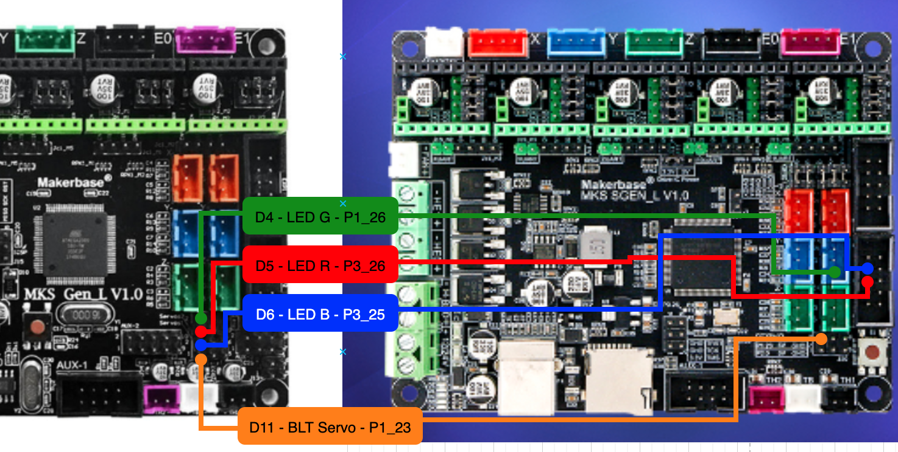
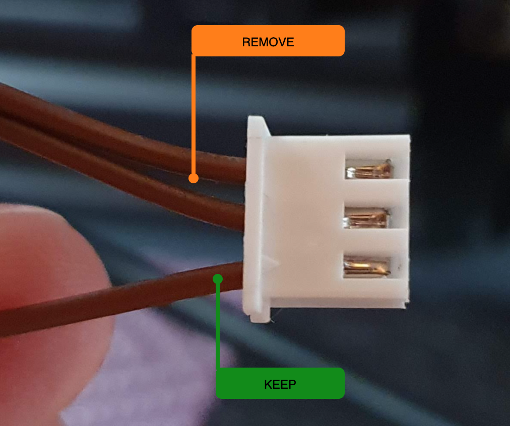

# Upgrade to a MKS SGEN L 32bit board

This page will describe how you can upgrade your Artillery Genius (works for the Sidewinder also with small firmware changes) to a **MKS SGEN L** 32bit board and **MKS TMC2209 V2.0** stepper motor drivers. It will not cover the whole process in detail as it is a pretty straight forward replacement since the boards are almost identical and besides there are plenty of similar upgrade guides, instead I will focus on the key aspects specific to this board and drivers.

> **Work in progress**

## Preparation

I suggest you make or print yourself some sort of identification for your cables like the ones mentioned in the [upgrades section](upgrades.html#labels-for-your-cables). It will make tracking all those wires much easier.

As for tools, you will need a number **2 [allen key](https://en.wikipedia.org/wiki/Hex_key)** and a **small flat screwdriver**. If you don't allready the [Mako Precision Bit Set](https://eustore.ifixit.com/products/mako-driver-kit-64-precision-bits) from iFixit is a must have and I cannot recommend it enough. You will also need **tweezers** to help you remove some of the connectors and some IPA to get rid if the glue.

Make sure you have plenty of space on your workbench and move the X gauntry up top so it stays out of the way.

## Board setup

First things first, you need to **setup the jumpers on the new board** for the TMC2209 drivers in UUART mode and with sensorless homing.

- all the jumpers underneath the drivers need to be removed (red)
- place jumpers in front of each driver on the UART selection slots (green)
- place jumpers on the X and Y DIAG slots (blue)
- move the driver voltage selection from 5V to 3.3V (orange)

You can now **place the drivers** in their dedicated slots on the mainboard and mount their heatsinks.

## Remove the old board

Dificulty of this taks depends on how 'good' of a job the glue guy did when assembling your printer. If there is a lot of glue all over the connectors **spraying some IPA** over it and letting it soak for 1-2 min will help decompose the glue and it will be much easier to remove.

While removing the cables **apply some way of identification** to them as it will help you a lot later as the cables are not long enough to be able to be simply moved from the old board to the new so you have to disconnect them all first.

**Taking a few pictures of the board** with all the cables from different angles might also help you have a reference later on.

You should start by **removing all plugs one by one while also labeling them**. Next release the board by removing it's 4 screws located on the corners. Now you have easier access to the screw terminal wires on the left of the board because they are rather short.

## Connections

Both boards have the same layout, this is the reason I personaly have chosen the **MKS SGEN L** instead of the **BTT SKR 1.3** or **1.4**. So all the connectors except the ones for the extruder LED and BLTouch (if you have a Genius) go in the same place on the new board.

Old board | Description | New Board
---|---|---
D4 | **LED G**reen | P1_26 (on the X max endstop)
D5 | **LED R**ed | P3_26 (on EXP2)
D6 | **LED B**lue | P3_25 (on EXP2)
D11| **BLTouch servo** | P1_23

The LED wires are connected in a plug that fits the X max endstop connector, so just remove the 2 other wires from the plug and insert it in the X max endstop. You can add a bit of heatshrink tube to the other wires and plug them in their place in the EXP2 connector.

**Please use the pinouts available in the MakerBase GitHub for more detailed pinout information**:
- [MKS GEN L pinout](https://github.com/makerbase-mks/MKS-GEN_L/blob/master/hardware/MKS%20Gen_L%20V1.0_008/MKS%20Gen_L%20V1.0_008%20PIN.pdf) - old board
- [MKS SGEN L pinout](https://github.com/makerbase-mks/SGEN_L/blob/master/Hardware/MKS%20SGEN_L%20V1.0_001/MKS%20SGEN_L%20V1.0_001%20PIN.pdf) - new board

One other thing you might have some trouble with (like I did because of the ton of glue on top of them) are the **2 reset wires** coming from the TFT (the black and red pair). They go in the same place as on the old board. 

Old board | Description | New Board
---|---|---
GND on Exp2 | Reset red | GND on EXP2
RST on Exp2 | Reset black | RST on EXP2

I have also added control for case lighting with `M355` on pin **P1_00** located on the **EXP1** connector.

## Mainboard Firmware

[Repository for the firmware](https://github.com/kind3r/genius-firmware-mks-sgen-l)

## TFT Firmware

All topics:
