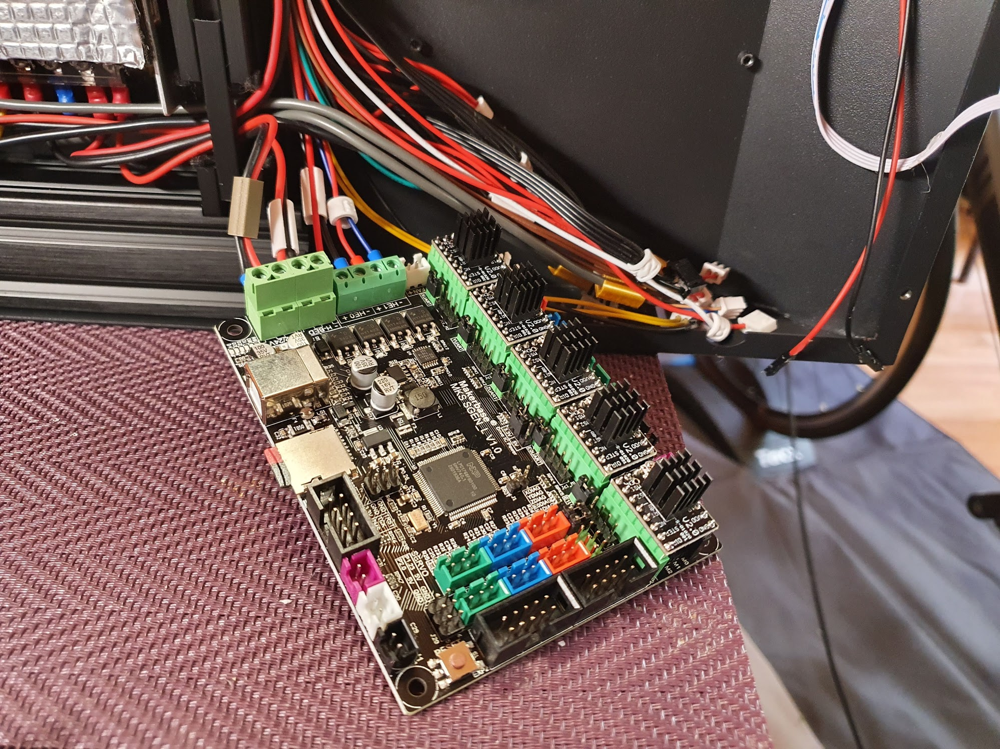
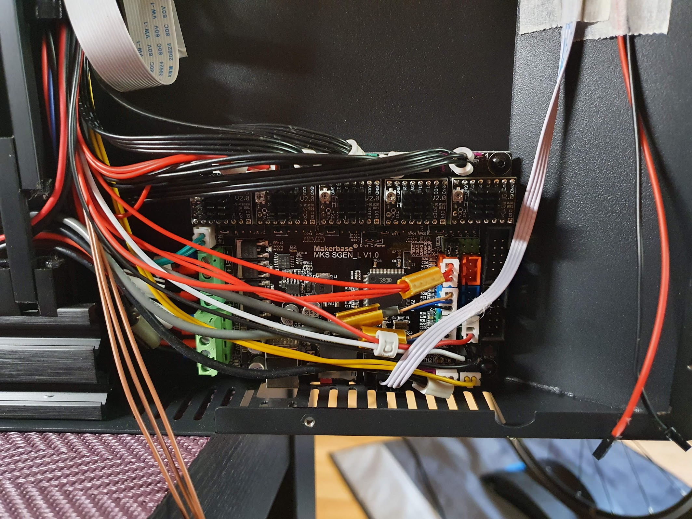

This page will describe how you can upgrade your Artillery Genius (works for the Sidewinder also with small firmware changes) to a **MKS SGEN L** 32bit board and **MKS TMC2209 V2.0** stepper motor drivers. It will not cover the whole process in detail as it is a pretty straight forward replacement since the boards are almost identical and besides there are plenty of similar upgrade guides, instead I will focus on the key aspects specific to this board and drivers.

## Preparation

I suggest you make or print yourself some sort of identification for your cables like the ones mentioned in the [upgrades section](upgrades.html#labels-for-your-cables). It will make tracking all those wires much easier.

Head yourself to the MakerBase GitHub pages and take a look at the layout of both boards:
- [MKS GEN L](https://github.com/makerbase-mks/MKS-GEN_L/tree/master/hardware/MKS%20Gen_L%20V1.0_008)
- [MKS SGEN L](https://github.com/makerbase-mks/SGEN_L/tree/master/Hardware/MKS%20SGEN_L%20V1.0_001)

Especially **the PIN files are important** as they show you the pin layout of each board. The pins have different labels as the CPU is different and the labeling scheme is derived from that. You might notice they are almost the same except for the lack of Servo 2 ports and the AUX-2 and AUX-3 on the **SGEN**. So we will have to find a way around that if we still want to use the extruder LED.

As for tools, you will need a number **2 [allen key](https://en.wikipedia.org/wiki/Hex_key)** and a **small flat screwdriver**. If you don't allready the [Mako Precision Bit Set](https://eustore.ifixit.com/products/mako-driver-kit-64-precision-bits) from iFixit is a must have and I cannot recommend it enough. A pair of **tweezers** will help you remove some of the connectors and some IPA to get rid if the glue. A **Dremel with a disk or a drill** to make a hole for the SD Card slot.

Make sure you have plenty of space on your workbench and move the X gauntry up top so it stays out of the way.

Before you remove your old board, connect it to a terminal and save the output of your `M503` so that you can later compare it with the defaults for the new board in case want to restore some of your old settings. This will be especially useful in setting your [BLTouch Z-Offset](upgrades.html#auto-bed-leveling).

## Board setup

First things first, you need to **setup the jumpers on the new board** for the TMC2209 drivers in UUART mode and with sensorless homing.

- all the jumpers underneath the drivers need to be removed (red)
- place jumpers in front of each driver on the UART selection slots (green)
- place jumpers on the X and Y DIAG slots (blue)
- move the driver voltage selection from 5V to 3.3V (orange)

You can now **place the drivers** in their dedicated slots on the mainboard and mount their heatsinks.

### Mainboard Firmware

My printer is an Artillery Genius equiped with a BLTouch clone so the firmware is setup to work with that. If you don't want to use the BLTouch or if you want to use it on a Sidewinder you will need to bake your own custom version.

Head over to my [MKS SGEN L GitHub repository](https://github.com/kind3r/genius-firmware-mks-sgen-l/releases) and download the latest firware that starts with SGEN (all other are the official Marlin releases). Place the `firmware.bin` on the root of a SD Card and insert it into your new board. Connect the USB cable to a PC, this should start the update process, you should see the LED on the boads LED flashing. This should take about 20 seconds (don't quote me on that, it's fast anyway). 

Use something like Pronterface (or any other terminal) to **connect to your board serial port** via the USB connected to the PC (find your serial port, use 250000 as baud rate) and reset the EEPROM to defaults by issuing `M502` and `M500`. Check the new defaults with `M503`. Update your Z-Offset (`M851 Z-_.__`) from the defaults of the old board.

If you have a **24V power supply** handy, you can also hook the board to it now to test the stepper drivers communication with `M122`. Only powering from USB will not enable the drivers and `M122` will show errors.

> TODO: instructions for non-BLT users (remove probe, switch Z endstop pins, build)

> [Repository for the custom MKS SGEN L firmware](https://github.com/kind3r/genius-firmware-mks-sgen-l) in case you want to build your own

### TFT Firmware

Your previous TFT firmware should work just fine and there is no need to change it. However, since after the initial BLTouch setup you won't have much use for those Z-Offset adjustments (I make small adjustments straight in the slicer based on temperature and observations), EEPROM reset etc., you can flash my custom version which adds control for the case lights.

> TODO: Create TFT firmware repository

## Remove the old board

Dificulty of this taks depends on how 'good' of a job the glue guy did when assembling your printer. If there is a lot of glue all over the connectors **spraying some IPA** over it and letting it soak for 1-2 min will help decompose the glue and it will be much easier to remove.

While removing the cables **apply some way of identification** to them (based on the PIN file of the GEN L board) as it will help you later since the cables are not long enough to be able to be simply moved from the old board to the new so you have to disconnect them all first.

Here are a few examples of not so obvious connectors (in clockwise order around the board) to help in labeling:
- The **2nd Z motor** is connected to the **E1 motor port**
- The **2 reset wires** comming from the TFT are connected to **EXT2 pins** GND (red) and RST (black)
- **Hotend thermistor** is connected to the **TH1 thermistor port**
- **Bed thermistor** is connected to the **TB thermistor port**
- **Bed heating element** is connected to the **H-BED screw in terminal**
- **Extruder heating** element is connected to the **HE0 screw-in terminal**
- **Part cooling fan** is connected to **HE1 screw-in terminal**
- **Heatbreak fan** is connected to the **FAN port**.

**Taking a few pictures of the board** with all the cables from different angles might also help you have a reference later on.

You should start by **removing all plugs one by one while also labeling them**. Next release the board by removing it's 4 screws located on the corners. Now you have easier access to the screw terminal wires on the left of the board because they are rather short.

After removing the old board, place the new board in it's place, **mark the location of the SD Card slot on the printer's case** and make a hole for it as you want to be accesing it externaly to update the firmware or use it to store G-code or whatever other reason. Even tho you can access the SD Card remotely via the USB connection, you still need one inserted to perform firmware updates (because Marlin 2.x updates often) and you won't be able to install the board with the SD Card inserted as it simply won't fit because of the printer's case getting in the way.

I have used a Dremel with a disk accompanied by a vacuum cleaner to prevent the **aluminium dust** from the case geting all over the printer, and slowly made my way through the case. Drilling some holes next to each other also works. Just make sure you polish the surface and vacuum all the tiny aluminium dust cause those can be very bad if they get on the electronics.

## Connector mapping

Both boards have the same layout, this is the reason I personaly chose the **MKS SGEN L** instead of the **BTT SKR 1.3** (or **1.4**). So all the connectors except the ones for the extruder LED and BLTouch (if you have a Genius) go in the same place on the new board.

Old board | Description | New Board
---|---|---
D4 | **LED G**reen | P1_26 (on the X max endstop)
D5 | **LED R**ed | P3_26 (on EXP2)
D6 | **LED B**lue | P3_25 (on EXP2)
D11| **BLTouch servo** | P1_23

The LED wires are connected in a plug that fits the X max endstop connector, so just remove the 2 other wires from the plug and insert it in the X max endstop. You can add a bit of heatshrink tube to the other wires and plug them in their place in the EXP2 connector.

**Please use the pinouts available in the MakerBase GitHub for more detailed pinout information**:
- [MKS GEN L pinout](https://github.com/makerbase-mks/MKS-GEN_L/blob/master/hardware/MKS%20Gen_L%20V1.0_008/MKS%20Gen_L%20V1.0_008%20PIN.pdf) - old board
- [MKS SGEN L pinout](https://github.com/makerbase-mks/SGEN_L/blob/master/Hardware/MKS%20SGEN_L%20V1.0_001/MKS%20SGEN_L%20V1.0_001%20PIN.pdf) - new board

One other connector you might have some trouble with (like I did because of the ton of glue on top of them) are the **2 reset wires** coming from the TFT (the black and red pair). They go in the same place as on the old board. 

Old board | Description | New Board
---|---|---
GND on Exp2 | Reset red | GND on EXP2
RST on Exp2 | Reset black | RST on EXP2

I have also added control for case lighting with `M355` on pin **P1_00** located on the **EXP1** connector. I use it to control some 24V LED strips via a MOSFET that I had laying around.

## Install the new board

No that you got the ideea of what goes where, start by connecting the wires to the screw terminals left of the board.

After that you can sit the board in it's resting place and fix it with the screws. You can now easily plug in the rest of the wires.

Before closing the printer you should run a few tests:
- Check the thermistors are working and showing the room temperature
- Check all axis are moving in the right directions
- Check that the bed heats
- Check that the part cooling fan works
- Check that the extruder heats (and the heatbreak fan starts spinning)
- Connect to a computer and check your BLT probe is working properly (in order)
  - `M280 P0 S10` - probe pin should extend
  - `M119` - should now report z_min endstop as **open** 
  - `M280 P0 S90` - probe pin should retract
  - `M119` - should now report z_min endstop status as **TRIGGERED**
- Home the printer with `G28` and run ABL with `G29` 

If all went you can now assemble the base of your printer and start fine tunning.

## Fine tunning

- steps
- z-offset
- max/default speed and acceleration

> **Work in progress**