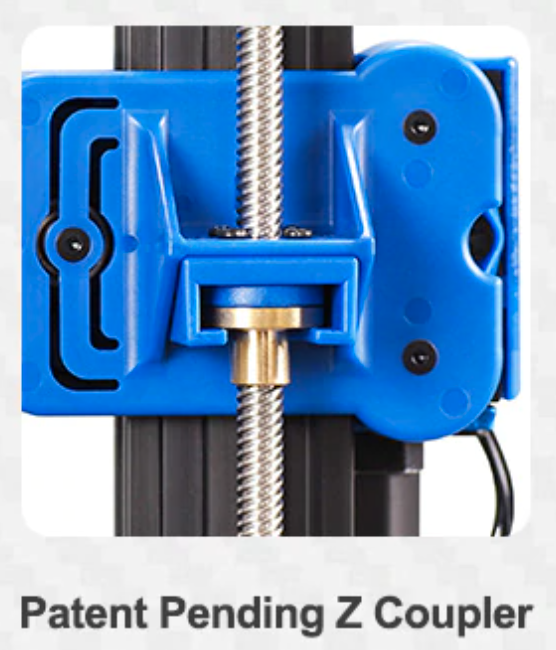
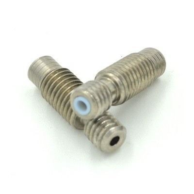
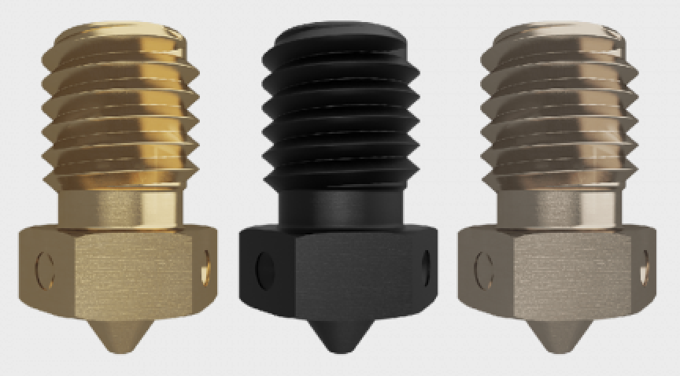
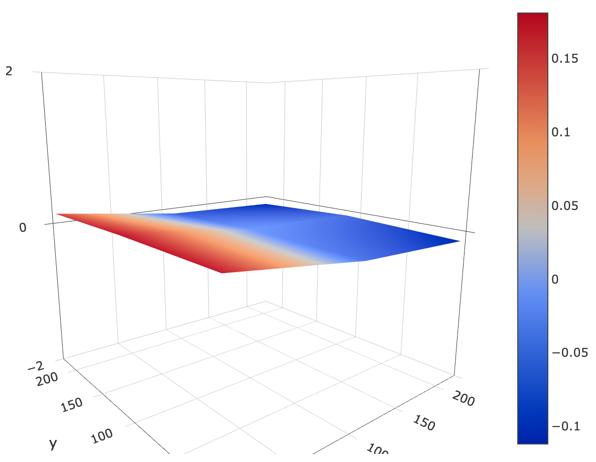

# The 3D printer

At it's core level, a 3D printer is basicaly a molten plastic spiting contraption (extruder block or tool) that can move in 3D space to create your model. For a better comparison, think of a motorized hot glue gun. 

> TODO: 3d printer schema (screen, mainboard, drivers, motors, extruder)

In order to be able to achive the 3D spatial movement, the [cartesian](https://en.wikipedia.org/wiki/Cartesian_coordinate_robot) printer has 3 axis (X, Y and Z) independently controlled by 3 or more stepper motors which ensure precise movement of the extruder block so that the molten plastic is dropped where it needs to be. X and Y axis are both on the horizontal plane leaving the Z axis for vertical movement. 

> A great article explaining all the movements of the axis can be found here: [3D Printer Axis: The Basics](https://all3dp.com/2/3d-printer-axis-all-you-need-to-know/). 

> For more details about the stepper motors watch: [How does a Stepper Motor work ?](https://www.youtube.com/watch?v=eyqwLiowZiU). 

Now that you have an ideea about the movement of the motors, let's investigate the role of the motor driver. The driver handles routing the power to the 2 stepper motor coil pairs while providing an easy control interface. The printer's CPU tells the driver to move a specified number of steps in some direction with a specified speed and the driver translates this into alternating current for the 2 coil pairs in order to perform the specified move. Drivers can perform silent moves by using babystepping technology, they can also detect if a motor moved or not thus providing virtual endstops. 

A stepper motor (and driver) has no way of knowing it's current position, let alone the position of the axis it's moving. What it can do, is mark it's current position as an initial refference and record future positions relative to that initial refference. So in order to have the actual position relative to the print surface, printers use endstops as a reference position of one axis (normaly the 0 coordinate). That is what **homing** is for. The printer moves the specified axis motor slowly in the direction of the endstop until that endstop triggers and then records that position as being 0 for that axis. All further moves will now have a reference point so the CPU can address coordinates directly.

## X and Y axis

X and Y axis work in similar ways, they are both usually controlled by a single stepper motor each and a belt that moves the extruder block left and right for the X axis and the bed (back and front) for Y axis. 

Common issues with X and Y axis derive from the tightness of the belts. If the belts for those axis are too lose, when the motor is turning the belt might not so the desired movement is not transmited to the extruder block or the bed, resulting in shifting layers. On the other hand, if the belt is too tight it will put too much pressure on the axle of the motor and the motor itself won't be able to move, also resluting in shifting layers. 

Other issues can come from the fact that the moving parts (the bed and the extruder block) are not properly fixed to their frame on which they slide. On some printers metal rods with linear ball bearings are used. But in case of Artillery aluminium v-rails are used to suport the heavier direct drive extruder (more about later). On this type of system, wheels on one side of the rail have excentric spacers that allows moving the wheel closer or farther from the rail thus making sure the moving part only slides on the desired axis. If the wheels are too close to the rail, the motor will have difficulty pulling the bed or the extruder block and will create wear on the belts and the wheels. If the wheels are too far, then the moving part will have a play and this will lead to inconsistent layers.

## Z axis

Z axis is a bit different. The motor is connected to a threaded rod via a coupler. This works like a nut on a screw: you turn the screw and the nut goes up or down. Of course, the screw (rod) being so long, issues can apear if it's not perfectly straight. This is why the coupler has a flexible part designed to compensate for the rod not being perfectly straight. The Genius on the other hand uses a different mechanism in the form of a **Z nut coupler** mounted on the X caridge that alows some play to compensate for a not so straight rod. Is this better than a flexible coupler ? Time will tell.

## Extruder block

The extruder block (or generic tool) is responsible for droping molten plastic on the print surface. It's centerpiece is the **hotend**, this is where most of the magic happens. The basic principle is that a **heating element** heats the **heatblock** which in turn heats the **nozzle** while the **thermistor** monitors the temperature. The role of the **heatbreak** is to stop the heat coming from the **heatblock** to transfer to the other parts of the extruder block. The filament is pushed through the heatbreak and reaches the nozzle where it melts and is then extruded on the print surface. In order to further help disipate the heat coming from the heatblock, the heatbreak is also conected to a **radiator cooled by a fan**.

> For more details about the hotend parts (**nozzle, heatblock, heating element, thermistor** and **heatbreak**) watch [Hotend explained](https://www.youtube.com/watch?v=OzRAVkXjw3I).

There are 2 types of heatbreaks:
- PTFE lined
- All metal

Both types have advantages and disadvantages.

PTFE lined | All metal
---------- | ---------
Better thermal insulation between the heatbreak and filament | Prone to clogs
At 250C PTFE tube degrades and releases toxic fumes | Works for temperatures above 250C, good for nylon or PC
PTFE tube will degrade over time as it's in contact with the nozzle and will need to be replaced | Less maintenance
Better retraction | Slightly worse retraction

As you can see from the comparison, all metal heatbreaks allow you to print higher temp speciality materials like nylon but printing common ones can be troublesome as the lack of thermal insulation provided by the PTFE tube could melt PLA inside the heatbrake and cause it to clog.

Recent advancements let to the creation of the bi-metal heatbreak, basically a variation of the all metal one with an extra layer designed to provide better insulation between the heatbreak and the filament flowing through it.

> Read here a review of bi-metal heatbreak [Bi-Metal Heat Break Review – No More Clogs!](https://3dprintbeginner.com/bi-metal-heat-break/)

There are two commonly used nozzle sizes: **Volcano** and **V6**. They were both developed by E3D.

> Throughout the brief history of the 3D Printing Industry, E3D has become synonymous with quality and reliability, leading the market with our modular V6 high performance HotEnd. <https://e3d-online.com/nozzles-for-3d-printer>

It should be prety obvious that the **Volcano** style, having a longer melt zone, offers an advantage over the **V6** being able to print faster as filament has more time to melt. But, since the filament spends more time in the melt zone, this can act like a double edged sword. Filament will ooze from the nozzle more often, this in turn can increase stringing if retraction is not properly setup and it can even burn out inside the nozzle leading to partial clogs. This is why it's important to use a good quality filament, but more on that later.

Of course, nozzles can be made from different materials having different properties, depending on your printing needs. 

Most common material is **brass**, this has the advantage of a very good thermal transfer between the heat block and the nozzle but being a soft material it wears over time. The wear can lead to partial clogs, imprecise printing and plastic sticking to it leaving blobs on your print. But, being very cheap it's affordable to replace in case this happens. 

**Hardened steel** nozzles offer wear resistance at the price of lower thermal transfer. They are a bit more expensive than **brass** ones and allow you to print tougher materials like carbon fiber, wood and metal infused filaments without having to worry about possible wear. 

Other nozzle materials include **stainless steel**, **plated copper** and my favourite nickel plated hadrened steel Nozzle X.

> Read more about [Nozzle Materials](https://e3d-online.dozuki.com/Wiki/Nozzle_Materials) on E3D's website.

Nozzle build quality is very important for a succesfull print, **save yourself the trouble and get a good quality set of nozzles**. If you find E3D's pricing a bit too much, you can look for other know good brands on Aliexpress such as [Mellow](https://mellow.aliexpress.com/store/1531088?spm=a2g0s.9042311.0.0.f9144c4dxYeTik) or [Trianglelab](https://trianglelab.aliexpress.com/store/1654223?spm=a2g0s.9042311.0.0.f9144c4dxYeTik). Cheap nozzles often have imperfections due to the manufacturing process, either deviations from the dimensions or even leftover materials that eventualy lead to clogs or worse.

Another component of the extruder block is the **part cooling fan**. This helps cooling the extruded material so that it does not melt over the previous layer. While cooling is required by some materials like PLA, other materials require very little or no cooling at all (ABS, ASA etc.). A good fan shroud can help guide the airflow where it's actually needed and not spread the air it all over the place.

In case of Artillery and other **direct drive** printers, the extruder block also contains the filament feeder motor and gear. Other printers have this feeder placed somewhere else and connect it via a PTFE tube to the heatbreak. This is called a **bowden** extruder. In short, direct drive alows for more materials to be printed (like flexibles) and performs a better extrusion and faster retraction leading to less stringing. On the other hand it adds weight to the extruder block increasing inertia of it's movement and possibly adding vibrations leading to inconsistency of the layers.

> A good comparison between both systems can be found in the [Direct vs Bowden Extruder: Does It Make a Difference?](https://all3dp.com/2/direct-vs-bowden-extruder-technology-shootout/) article.

The extruder block may also contain a bed leveling probe like the well known BLTouch. This probe acts similar to an endstop for the Z axis, except it can be placed almost anywhere on the bed as opposed to the regular endstop which has a fixed position. By probing multiple points on the bed, the printer's software can create a virtual image of the bed's surface and adjust all print moves acordingly.

## Print bed

The print bed is where your print resides during the printing process (duh). It plays an important role in the success of your print, especially during that **good first layer** that you probably heard all about. But what does this mean ?

Well, if your bed is not clean, not leveled properly or not at the temperature recommended for the material your are printing, then the print will not stick to the bed and will detach during printing and we don't want that to happen half time into your 8h print. 

> Further reading: [Best 3D Printing Bed Surfaces and Adhesion Methods](https://3dinsider.com/3d-printing-bed/)

Beds are made from different materials on which various plastics adhere more or less. Most people will recomment a PEI sheet on top of your bed. I had very good experience so far with Artillery's default ultrabase like surface. It doesn't really matter what type of surface you have, the following tips apply to any surface.

### A clean bed makes for a good night sleep

Clean your bed after every print with [IPA (Isopropyl alcohol)](https://en.wikipedia.org/wiki/Isopropyl_alcohol) or pure [Acetone](https://en.wikipedia.org/wiki/Acetone) (nail polish removers have acetone as a base but it's usually combined with something else that you don't want on your bed). This will help in removing leftover plastic particles and dust from the bed but most important it will elminate any grease left over by you touching the bed with your bare hands while removing a print.

### A leveled bed provides good adhesion and even layers

Leveling the bed is probably the most confusing part of the whole printing process, especially for a beginer. But don't worry, you'll get it after a few tries.

An important thing to note here is that you need to **re-level the bed each time you change printing temperatures** as both the bed and the nozzle/heatblock expand differently at each temperature level. The more heat, the more they expand and the closer they get to each other. Sometimes the differences are too small to matter but it can get as high as 0.2mm between 190C and 240C. That's a full layer !

After some trial and error using the paper under the nozzle method, I decided to do some further research and discovered the **leveling squares**. This worked perfect for me and it's a great and consistent way to get a good bed level every time. 

> How to level with leveling squares: [Best method for 3D printer bed levelling](https://www.youtube.com/watch?v=RZRY6kunAvs)

Not having the bed properly leveled can also lead to a **bad top and bottom layers**. If the nozzle is too close to the bed, it will scratch the first layer, it will collect the extra material and drop it in the middle of your print, and all other layers will be affected by this like a domino effect. Too far from the bed, then the material either won't stick to it or to the previous layer, once again leading to having issues further down your print.

### A heated surface also helps with adhesion

Nowadays all beds are heated, this is a standard feature. Heated surface is an important part of the adhesion of the first layer. Of course, the temperature depends on the material type.

As plastic also expands and contracts when subjected to heat it's best to keep the temperature close to the material's glass transition temperature (the temperature at which the material starts to melt - around 60C for PLA and 90C for PETG). This helps with adhesion and also prevents the material from contracting too much and deforming the print. Idealy the whole print should cool down at the same time but this doesn't actually happen unless you also have a heated enclosure. 

If a layer cools too fast, the print will deform and it will break the adhesion between layers. This mostly happens at the bed level and then the print pops off the bed. On the other hand, if the bed temperature is too high, the material can melt on the bed surface leading to that is commonly known as an *elephant foot*.

## Mainboard

The mainboard is the brains of your 3D printer. It's usually powered by an 8bit CPU like an Arduino (but more recently cheap 32bit boards are starting to become more popular), which runs a piece of software called **firmware** that interfaces with the motors and sensors and controls everything happening in your printer. 

The mainboard accepts G-code commands from an external or embeded source and performs the actions dictated by those commands. The source of the G-code commands is usually connected via a serial port to the CPU. Since the 8bit CPU has a very limited number of resources at it's disposal, the mainboard can only store and process a limited number of commands, so it's the responsability of the control source to make sure it sends the commands at a pace the printer can process them and has time to perform the required actions.

In case of Artillery, the TFT acts like an external device that can read files from SD Card or USB and send the contents of those files line by line to the mainboard while also monitoring the various sensors the mainboard has control over. Specific to Artillery setup is that the filament sensor is connected to the TFT which will pause printing by not sending further commands to the mainboard until the filament sensor issue is solved. Another thing to note is that the TFT and the USB connection of the mainboard share the same serial port so the TFT can interfere with communication over USB. More on that later.

When instructed to reach a specific temperature for the extruder or bed, the mainboard has to start and stop the heating element of that specific part while monitoring the temperature through termistors. The heating elements are just on/off, they either heat or they don't. There is no way to tell a heating element to heat for a specific temperature. In order to make things easier on the CPU, a calibration step called **PID tunning** is performed so that the firmware knows in advance how often should the heating element be turned on or off to maintain a specific temperature as constant as possible without having to pool the termistor all the time - which consumes a lot of CPU resources. Think something in the terms of muscle memory, you do things without having to thing about how you do them. This frees the CPU from having to check and decide what to do with the heating elements and leaves more resources for performing the actual printing moves.

The mainboard is also responsible for some safety features, depending on how the firmware was setup. This include protection against overheating of the bed and extruder, making sure that the movements of the motors stay whithin the phisical dimensions of the machine, not trying to extrude filament while the nozzle is cold etc. 

### Marlin firmware

Most printers run on [Marlin firmware](https://marlinfw.org/). There are two versions of Marlin available: 1.x and 2.x (I will just call them 1 and 2). 

**Version 1** is considered stable and no longer being developed. It only runs on 8bit platforms only and has all the features that those boards can support.

**Version 2** is under constant developement so releases are frequent. The main benefit versus Version 1 is that it can run on 32bit boards. The downside is that it brings no extra features for the 8bit boards but can introduce new bugs.

This is why owners of 8bit boards (like the ones in Artillery printers) should stick to Version 1. There is no real benefit to running Version 2 on 8bit boards and it can have the downside of adding new bugs.

There are various printer firmware builds out there, based on both Version 1 and 2, which basicaly enable or disable some of the features present in the Marlin firmware via configuration files. I decided to build my own firmware based on my needs and experience with the printer and I found it easy to do.

> TODO: list of firmwares

### G-code

A full list of the G-code commands can be found on Marlin's website [G-code Index](https://marlinfw.org/meta/gcode/). It's not a mandatory read but it's a good place to get information about what each command does when in doubt.

## Control screen

All printers have some sort of control interface that enables you to start printing from an SD Card or USB stick. It also allows you to issue some predifined commands to the mainboard (like moving each axis, start heating, turning fans on and off etc.) or make various firmware settings.

As mentioned previously, there are 2 types of controllers: the basic ones that are just a monocrome LCD with a rotary switch that connects and is controlled by the mainboard's firmware (like in Prusa printers for example) and independent ones like the color touch screens found in Artillery and other printers.

The independent ones like the MKS, BTT etc. are basically a separate device (also known as TFT) that communicates with the mainboard via a serial port and is able to send commands to it this way. They run their own firmware (some of them open source, some not) and are completly separate from the mainboard. They only comunicate with the mainboard via G-code commands, albeit the predefined ones that make up the touch user interface, or the one in the g-code files from SD Card or USB. 

In case of Artillery a MKS TFT28 is used which recently got open sourced, but the amount of customisation for this kind of device is limited at the moment to the icons and the 7 commands in the Tools -> More menu.

**Next step**: [Printing materials](materials)